# Mermaid ERD Diagram Patterns

## Overview

Mermaid ERD diagrams document Gold layer data models with clean, maintainable syntax. This skill standardizes ERD organization strategies, syntax standards, and relationship patterns for production-grade data modeling documentation.

## When to Use This Skill

- Documenting Gold layer data models
- Creating master ERDs for complete models
- Creating domain-specific ERDs for focused views
- Creating summary ERDs for large models (20+ tables)
- Establishing ERD organization strategies
- Standardizing relationship notation

## Critical Rules

### 1. ERD Organization Strategy

| Tables | Approach | Rationale |
|--------|----------|-----------|
| **1-8 tables** | Master ERD only | Simple enough to visualize in one diagram |
| **9-20 tables** | Master ERD + Domain ERDs | Too complex for single diagram, needs breakdown |
| **20+ tables** | Domain ERDs + Summary ERD | Master becomes unreadable, focus on domains |

### 2. Clean and Concise Syntax

❌ **DON'T:** Add inline comments to every column


✅ **DO:** Use simple PK markers, describe in documentation


**Rationale:** Inline comments clutter the diagram. Column descriptions belong in table documentation, not ERD.

### 3. Consistent Formatting

✅ **Use 2-space indentation consistently:**


### 4. Relationship Labeling

✅ **DO:** Use short, technical labels
```mermaid
dim_store ||--o{ fact_sales_daily : by_store_number
```

**Pattern:** `by_{column_name}` for join columns

### 5. Avoid Reserved Keywords

❌ **DON'T:** Use SQL reserved keywords as column names
```mermaid
dim_date {
  date date  -- 'date' is reserved
}
```

✅ **DO:** Use descriptive alternative names
```mermaid
dim_date {
  date date_value  -- Clear and unambiguous
}
```

## Quick Reference

### ERD Hierarchy

```
gold_layer_design/
├── erd_master.md              # Complete model (all tables)
├── erd_summary.md             # High-level domain relationships (optional, 20+ tables)
└── erd/                       # Domain-specific ERDs
    ├── erd_location.md
    ├── erd_product.md
    ├── erd_time.md
    ├── erd_sales.md
    └── erd_inventory.md
```

### Standard Domain Categories

| Domain | Emoji | Typical Tables | Description |
|--------|-------|----------------|-------------|
| **Location** | 🏪 | dim_store, dim_region, dim_territory | Geographic hierarchy |
| **Product** | 📦 | dim_product, dim_brand, dim_category | Product hierarchy |
| **Time** | 📅 | dim_date, dim_fiscal_period | Temporal dimensions |
| **Sales** | 💰 | fact_sales_* | Revenue & transactions |
| **Inventory** | 📊 | fact_inventory_* | Stock & replenishment |

### Relationship Cardinality Notation

| Notation | Meaning | Description |
|----------|---------|-------------|
| `\|\|--o{` | One-to-Many | One dimension record to many fact records |
| `\|\|--\|\|` | One-to-One | Rare in dimensional modeling |
| `}o--o{` | Many-to-Many | Requires bridge table |

**Most Common:** `||--o{` for dimension-to-fact relationships (star schema)

### Data Type Conventions

Use Databricks SQL type names: `string`, `int`, `bigint`, `double`, `date`, `timestamp`, `boolean`

See [ERD Syntax Reference](references/erd-syntax-reference.md) for complete reference.

## Core Patterns

### Master ERD Pattern

Shows the **complete data model** with all tables and relationships. Used for:
- Executive overview
- Data architect reference
- Completeness validation
- Cross-domain relationship visibility

**Template:**


### Domain ERD Pattern

Shows **focused view** of tables within a single business domain. Used for:
- Domain-specific stakeholder discussions
- Development team reference
- Detailed column documentation
- Domain change management

**Template:** See [ERD Template](assets/templates/erd-template.md)

### Cross-Domain Reference Pattern

Use bracketed syntax with domain annotation for tables from other domains:


### Summary ERD Pattern (20+ Tables)

For very large models, create a summary showing domains as entities:

```mermaid
erDiagram
  LOCATION_DOMAIN["🏪 Location (3 tables)"] {
    string dim_store
    string dim_region
  }
  
  SALES_DOMAIN["💰 Sales (2 facts)"] {
    string fact_sales_daily
  }
  
  LOCATION_DOMAIN ||--o{ SALES_DOMAIN : "store analysis"
```



## Validation Checklist

### General ERD Standards
- [ ] Use 2-space indentation consistently
- [ ] Add section headers with visual separators
- [ ] Use only `PK` markers (no inline descriptions)
- [ ] Avoid reserved keywords (`date` → `date_value`)
- [ ] Use `by_{column}` pattern for relationship labels
- [ ] Group relationships at the end
- [ ] Match actual table/column names from DDL
- [ ] Use correct Databricks SQL type names

### Master vs Domain ERD Organization
- [ ] Table count assessed (1-8: Master only, 9-20: Master + Domain, 20+: Domain + Summary)
- [ ] Master ERD created showing all tables
- [ ] Domain ERDs created for each logical domain (if 9+ tables)
- [ ] Summary ERD created showing domain relationships (if 20+ tables)
- [ ] Cross-domain relationships documented in both Master and Domain ERDs
- [ ] Domain index table included in Master ERD
- [ ] External table references use bracketed notation with domain labels

### File Organization
- [ ] ERDs stored in `gold_layer_design/` directory
- [ ] Master ERD named `erd_master.md`
- [ ] Domain ERDs in `erd/` subdirectory named `erd_{domain}.md`
- [ ] All ERDs link to related ERDs and YAML schemas

## Common Mistakes to Avoid

### ❌ Mistake 1: Over-documentation in ERD
```mermaid
store_key PK "Unique identifier for each version"
```
**Fix:** Use simple `PK` marker, document in separate table

### ❌ Mistake 2: Inconsistent indentation
```mermaid
dim_store {
string store_key PK
    string store_number
  string store_name
}
```
**Fix:** Use consistent 2-space indentation

### ❌ Mistake 3: Missing section headers
```mermaid
erDiagram
  dim_store { ... }
  fact_sales { ... }
```
**Fix:** Add `%% Dimensions` and `%% Facts` headers

### ❌ Mistake 4: Verbose relationship labels
```mermaid
dim_store ||--o{ fact_sales : "Each store can have many sales transactions"
```
**Fix:** Use concise label: `by_store_number`

## Reference Files

### ERD Syntax Reference
[references/erd-syntax-reference.md](references/erd-syntax-reference.md) - Complete Mermaid ERD syntax reference including data types, primary key markers, relationship notation, formatting standards, reserved keyword avoidance, and detailed examples.

## Assets

### ERD Template
[assets/templates/erd-template.md](assets/templates/erd-template.md) - Starter ERD diagram template for domain-specific ERDs with cross-domain reference patterns.

## References

- [Mermaid ERD Syntax](https://mermaid.js.org/syntax/entityRelationshipDiagram.html)
- [Databricks Data Types](https://docs.databricks.com/sql/language-manual/sql-ref-datatypes.html)
- [Star Schema Design](https://www.kimballgroup.com/data-warehouse-business-intelligence-resources/kimball-techniques/dimensional-modeling-techniques/)
