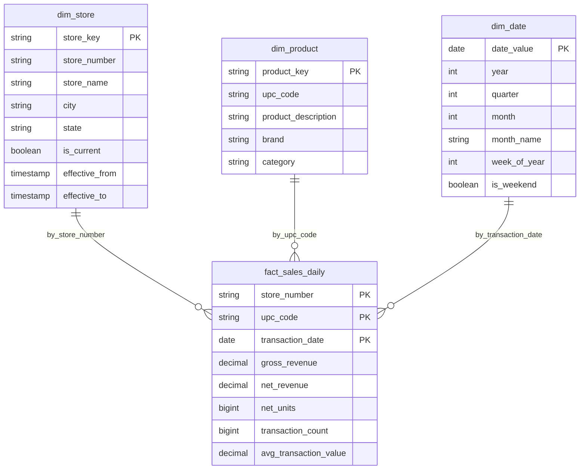
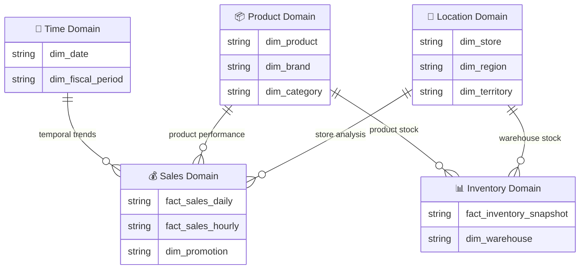

# ERD Organization Strategy

Extracted from `context/prompts/03a-gold-layer-design-prompt.md` Step 2. Use alongside the `mermaid-erd-patterns` skill for complete ERD syntax reference.

---

## ERD Organization Decision Tree

| Total Tables | ERD Strategy | Rationale |
|--------------|--------------|-----------|
| **1-8 tables** | Master ERD only | Simple enough for single diagram |
| **9-20 tables** | Master + Domain ERDs | Too complex for single view, needs breakdown |
| **20+ tables** | Master + Domain + Summary | Focus on domains, summary for navigation |

---

## Master ERD Pattern (Always Create)

**File:** `gold_layer_design/erd_master.md`

Shows the **complete data model** with all tables and relationships.

**Requirements:**
- Show ALL dimensions and facts (complete model)
- Group tables by domain with section headers
- Use domain emoji markers for visual clarity
- Show all relationships with cardinality
- Use `PK` markers only (no inline descriptions)
- Use `by_{column}` pattern for relationship labels
- Include Domain Index table after diagram

**Template:**



**Domain Index (include after Master ERD):**

| Domain | Tables | Primary Fact | Detail ERD |
|--------|--------|--------------|------------|
| 🏪 Location | dim_store | N/A | [erd_location.md](erd/erd_location.md) |
| 📦 Product | dim_product | N/A | [erd_product.md](erd/erd_product.md) |
| 📅 Time | dim_date | N/A | [erd_time.md](erd/erd_time.md) |
| 💰 Sales | fact_sales_daily | fact_sales_daily | [erd_sales.md](erd/erd_sales.md) |

---

## Domain ERD Pattern (If 9+ Tables)

**File:** `gold_layer_design/erd/erd_{domain}.md`

Shows a **focused view** of tables within a single business domain.

**Requirements:**
- Focus on tables within the domain
- Show external tables with domain labels (e.g., `["🏪 dim_store (Location)"]`)
- Include Cross-Domain Dependencies table
- Link to Master ERD and related Domain ERDs
- Document domain-specific business context

**Template:**

```markdown
# Sales Domain ERD

## Domain Overview
Sales domain contains transactional fact tables and related dimensions for 
revenue analysis, transaction trends, and promotional effectiveness.

**Tables in this domain:** 3
**Related domains:** Location, Product, Time

## Entity Relationship Diagram

(Mermaid ERD here with cross-domain references using bracketed notation)

## Cross-Domain Dependencies

| External Table | Domain | Relationship | Purpose |
|----------------|--------|--------------|---------|
| dim_store | Location | fact → dim_store | Geographic sales analysis |
| dim_product | Product | fact → dim_product | Product performance |
| dim_date | Time | fact → dim_date | Temporal trends |

## Related Documentation
- [Master ERD](../erd_master.md)
- [Location Domain ERD](erd_location.md)
- [YAML Schema](../yaml/sales/fact_sales_daily.yaml)
```

---

## Summary ERD Pattern (If 20+ Tables)

**File:** `gold_layer_design/erd_summary.md`

For very large models, create a high-level view showing domains as entities.



---

## File Organization

```
gold_layer_design/
├── erd_master.md                 # Complete model (ALWAYS)
├── erd_summary.md                # Domain overview (20+ tables)
├── erd/                          # Domain ERDs (9+ tables)
│   ├── erd_location.md
│   ├── erd_product.md
│   ├── erd_time.md
│   ├── erd_sales.md
│   ├── erd_inventory.md
│   └── erd_customer.md
├── yaml/                         # YAML schemas organized by domain
│   ├── location/
│   │   └── dim_store.yaml
│   ├── product/
│   │   └── dim_product.yaml
│   ├── time/
│   │   └── dim_date.yaml
│   └── sales/
│       └── fact_sales_daily.yaml
├── COLUMN_LINEAGE.md
└── DESIGN_SUMMARY.md
```

**See `mermaid-erd-patterns` skill for complete ERD syntax and formatting standards.**
