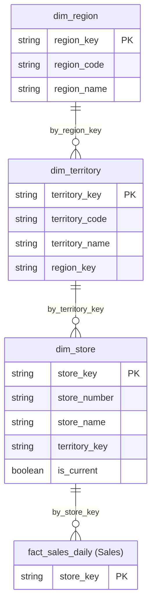

# Domain ERD Template

Use this template for creating domain-specific ERDs. Replace placeholders with actual table and column names.

```mermaid
erDiagram
  %% ═══════════════════════════════════════════════
  %% {DOMAIN_EMOJI} {DOMAIN_NAME} DOMAIN
  %% ═══════════════════════════════════════════════
  
  %% Dimensions in this domain
  dim_{entity1} {
    string {entity1}_key PK
    string {business_key1}
    boolean is_current
  }
  
  dim_{entity2} {
    string {entity2}_key PK
    string {business_key2}
  }
  
  %% Facts in this domain (if applicable)
  fact_{subject}_{grain} {
    string {entity1}_key PK
    string {entity2}_key PK
    int date_key PK
    decimal {measure1}
    int {measure2}
  }
  
  %% Cross-domain references (from other domains)
  dim_{external_entity}["dim_{external_entity} ({External Domain})"] {
    string {external_entity}_key PK
  }
  
  %% ═══════════════════════════════════════════════
  %% RELATIONSHIPS
  %% ═══════════════════════════════════════════════
  
  %% Within-domain relationships
  dim_{entity1} ||--o{ fact_{subject}_{grain} : by_{entity1}_key
  dim_{entity2} ||--o{ fact_{subject}_{grain} : by_{entity2}_key
  
  %% Cross-domain relationships
  dim_{external_entity} ||--o{ fact_{subject}_{grain} : by_{external_entity}_key
```

## Usage Instructions

1. **Replace Domain Placeholders:**
   - `{DOMAIN_EMOJI}` - Emoji for domain (🏪, 📦, 📅, 💰, 📊)
   - `{DOMAIN_NAME}` - Domain name (Location, Product, Time, Sales, Inventory)

2. **Replace Entity Placeholders:**
   - `{entity1}`, `{entity2}` - Entity names (store, product, date)
   - `{business_key1}`, `{business_key2}` - Business key column names
   - `{subject}` - Fact subject (sales, inventory, revenue)
   - `{grain}` - Fact grain (daily, monthly, snapshot)

3. **Replace Column Placeholders:**
   - `{measure1}`, `{measure2}` - Measure column names
   - `{external_entity}` - External entity name from another domain

4. **Add Domain-Specific Columns:**
   - Add all columns relevant to this domain
   - Include SCD Type 2 fields if applicable (`effective_from`, `effective_to`, `is_current`)
   - Include all measures for fact tables

5. **Document Relationships:**
   - Within-domain relationships (dimension to dimension, dimension to fact)
   - Cross-domain relationships (external dimensions to facts)

## Example: Location Domain ERD



## Notes

- Keep column lists focused on key columns (PK, business keys, important attributes)
- Use cross-domain references for tables from other domains
- Group relationships at the end for clarity
- Link to master ERD and YAML schemas in documentation
