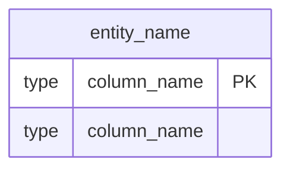
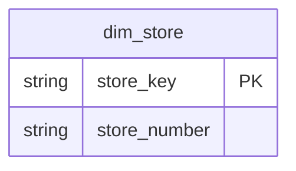

# ERD Syntax Guide

Complete Mermaid ERD syntax reference including data types, primary key markers, relationship notation, formatting standards, and reserved keyword avoidance.

## Basic Syntax

### Entity Definition

### Primary Key Marker

Use `PK` marker (no quotes, no descriptions):

## Data Type Conventions

Use Databricks SQL type names: `string`, `int`, `bigint`, `double`, `date`, `timestamp`, `boolean`

## Relationship Notation

| Notation | Meaning | Description |
|----------|---------|-------------|
| `\|\|--o{` | One-to-Many | One dimension record to many fact records |
| `\|\|--\|\|` | One-to-One | Rare in dimensional modeling |
| `}o--o{` | Many-to-Many | Requires bridge table |

**Most Common:** `||--o{` for dimension-to-fact relationships (star schema)

## Formatting Standards

- Use **2-space indentation** consistently
- Use visual separators with domain emojis
- Group entities by domain, then group relationships at the end
- Avoid SQL reserved keywords (`date` → `date_value`)

See full guide for complete examples and patterns.
