# Mermaid ERD Syntax Reference

Complete Mermaid ERD syntax reference including data types, primary key markers, relationship notation, formatting standards, and reserved keyword avoidance.

## Basic Syntax

### Entity Definition


### Example


## Data Types

Use Databricks SQL type names:

| Databricks Type | Mermaid Usage | Example |
|-----------------|--------------|---------|
| `STRING` | `string` | `string store_key PK` |
| `INT` | `int` | `int date_key PK` |
| `BIGINT` | `bigint` | `bigint customer_id` |
| `DECIMAL(p,s)` | `decimal` | `decimal net_revenue` |
| `DOUBLE` | `double` | `double margin_pct` |
| `DATE` | `date` | `date transaction_date` |
| `TIMESTAMP` | `timestamp` | `timestamp effective_from` |
| `BOOLEAN` | `boolean` | `boolean is_current` |

## Primary Key Markers

### Standard Pattern


**Rules:**
- Use `PK` marker (uppercase) after column name
- Only mark primary key columns
- For composite keys, mark all PK columns: `string store_key PK`, `date date_key PK`

## Relationship Notation

### Cardinality Types

| Notation | Meaning | Usage |
|----------|---------|-------|
| `\|\|--o{` | One-to-Many | Dimension to Fact (most common) |
| `\|\|--\|\|` | One-to-One | Rare in dimensional modeling |
| `}o--o{` | Many-to-Many | Requires bridge table |

### Relationship Syntax

```mermaid
entity1 ||--o{ entity2 : label
```

### Examples

**One-to-Many (Dimension to Fact):**
```mermaid
dim_store ||--o{ fact_sales_daily : by_store_number
```

**Composite Key Relationship:**
```mermaid
dim_store ||--o{ fact_sales_daily : by_store_key
dim_product ||--o{ fact_sales_daily : by_product_key
dim_date ||--o{ fact_sales_daily : by_date_key
```

**Cross-Domain Reference:**
```mermaid
dim_store["dim_store (Location)"] ||--o{ fact_sales : by_store_number
```

## Formatting Standards

### Indentation

Use **2 spaces** consistently:


### Section Headers

Use visual separators and comments:


### Relationship Grouping

Group all relationships at the end:

```mermaid
erDiagram
  dim_store { ... }
  dim_product { ... }
  fact_sales { ... }
  
  %% ═══════════════════════════════════════════════
  %% RELATIONSHIPS
  %% ═══════════════════════════════════════════════
  dim_store ||--o{ fact_sales : by_store_key
  dim_product ||--o{ fact_sales : by_product_key
```

## Reserved Keywords

### Avoid SQL Reserved Keywords

**❌ Don't Use:**
```mermaid
dim_date {
  date date  -- 'date' is reserved keyword
  string order  -- 'order' is reserved keyword
  string group  -- 'group' is reserved keyword
}
```

**✅ Use Alternatives:**
```mermaid
dim_date {
  date date_value  -- Clear and unambiguous
  string order_number  -- Descriptive name
  string group_name  -- Descriptive name
}
```

### Common Reserved Keywords to Avoid

| Reserved | Alternative |
|----------|-------------|
| `date` | `date_value`, `calendar_date` |
| `order` | `order_number`, `order_id` |
| `group` | `group_name`, `group_id` |
| `user` | `user_name`, `user_id` |
| `table` | `table_name`, `table_id` |
| `key` | `key_value`, `key_id` |

## Relationship Labeling Patterns

### Standard Pattern: `by_{column_name}`

```mermaid
dim_store ||--o{ fact_sales : by_store_key
dim_product ||--o{ fact_sales : by_product_key
dim_date ||--o{ fact_sales : by_date_key
```

### Composite Key Pattern

For composite foreign keys, label each relationship separately:

```mermaid
dim_store ||--o{ fact_sales : by_store_key
dim_product ||--o{ fact_sales : by_product_key
dim_date ||--o{ fact_sales : by_date_key
```

## Cross-Domain References

### Bracketed Notation

Use bracketed syntax with domain annotation:


## Complete Example: Master ERD


## Domain-Specific ERD Example


## Summary ERD Pattern (20+ Tables)

For very large models, create a summary showing domains as entities:

```mermaid
erDiagram
  LOCATION_DOMAIN["🏪 Location (3 tables)"] {
    string dim_store
    string dim_region
    string dim_territory
  }
  
  PRODUCT_DOMAIN["📦 Product (2 tables)"] {
    string dim_product
    string dim_category
  }
  
  TIME_DOMAIN["📅 Time (1 table)"] {
    string dim_date
  }
  
  SALES_DOMAIN["💰 Sales (2 facts)"] {
    string fact_sales_daily
    string fact_sales_monthly
  }
  
  LOCATION_DOMAIN ||--o{ SALES_DOMAIN : "store analysis"
  PRODUCT_DOMAIN ||--o{ SALES_DOMAIN : "product analysis"
  TIME_DOMAIN ||--o{ SALES_DOMAIN : "time analysis"
```



## Best Practices Summary

1. **Use 2-space indentation** consistently
2. **Add section headers** with visual separators
3. **Use only `PK` markers** (no inline descriptions)
4. **Avoid reserved keywords** (`date` → `date_value`)
5. **Use `by_{column}` pattern** for relationship labels
6. **Group relationships** at the end
7. **Match actual table/column names** from DDL
8. **Use correct Databricks SQL type names**
9. **Use bracketed notation** for cross-domain references
10. **Keep labels concise** and technical

## References

- [Mermaid ERD Syntax](https://mermaid.js.org/syntax/entityRelationshipDiagram.html)
- [Databricks Data Types](https://docs.databricks.com/sql/language-manual/sql-ref-datatypes.html)
