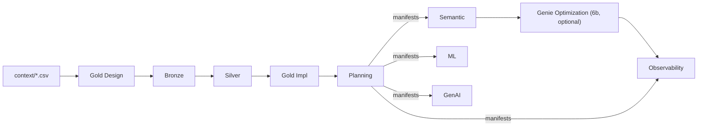
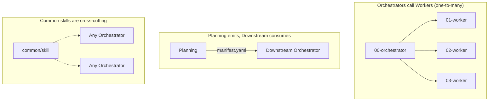

# 10 — Skill Navigation Visual Guide

## Overview

This document explains how the AI agent navigates the 59 Agent Skills in the Data Product Accelerator framework. An **interactive animated visualization** is available in the companion file:

> **[Open the Interactive Animation](10-skill-navigation-visual-guide.html)** — a self-contained HTML file with step-through animation, keyboard controls, and narrated walkthrough. Open it in any browser.

The animation shows the agent's progressive journey from `AGENTS.md` through the 9 core pipeline stages plus optional stage `6b` (Genie Optimization), highlighting orchestrators, workers, common skills, and the Plan-as-Contract manifest handoff in real time.

### Controls

| Action | Button | Keyboard |
|--------|--------|----------|
| Play / Pause | Play button | `P` |
| Next step | Next button | `→` or `Space` |
| Previous step | Prev button | `←` |
| Reset | Reset button | `R` |
| Speed | Slider (0.5x–2x) | — |

---

## How Agent Navigation Works

### 1. Entry Point

The agent reads `AGENTS.md`, which is auto-loaded by the IDE (Cursor, Claude Code, Windsurf, Copilot, Codex). This file contains:

- A **keyword routing table** that maps user intent to orchestrator skills
- A **common skills index** listing the 8 shared skills
- A pointer to `skill-navigator/SKILL.md` for ambiguous tasks

```
User Prompt → AGENTS.md (auto-loaded) → Keyword Detection → Orchestrator
```

### 2. Keyword-Based Routing

The agent matches keywords in the user's prompt against the routing table:

| Keywords | Routes To |
|----------|-----------|
| "new project", "schema CSV" | Gold Design (stage 1) |
| "Bronze", "test data" | Bronze Setup (stage 2) |
| "Silver", "DLT" | Silver Setup (stage 3) |
| "Gold tables", "merge" | Gold Implementation (stage 4) |
| "project plan" | Planning (stage 5) |
| "metric view", "Genie" | Semantic Layer (stage 6) |
| "optimize Genie", "benchmark", "judge evaluation" | Genie Optimization (stage 6b, optional) |
| "monitoring", "dashboard" | Observability (stage 7) |
| "MLflow", "ML model" | ML Pipeline (stage 8) |
| "GenAI agent" | GenAI Agents (stage 9) |

If the task is ambiguous, the agent falls back to `skill-navigator/SKILL.md`, which has the full routing table with expanded keyword coverage across all skill domains.

### 3. Pipeline Progression

The pipeline follows a strict linear order through stages 1–5. Planning emits manifests for stages 6–9, and optional stage `6b` can run between Semantic and Observability:



### 4. Orchestrator/Worker Pattern

Each orchestrator (`00-` prefix) declares its workers in YAML frontmatter. It reads worker `SKILL.md` files at specific phases during execution:

```
Orchestrator (00-gold-layer-design)
  ├── Phase 2: Read 01-grain-definition
  ├── Phase 2: Read 02-dimension-patterns
  ├── Phase 2: Read 03-fact-table-patterns
  ├── Phase 2: Read 04-conformed-dimensions
  ├── Phase 3: Read 05-erd-diagrams
  ├── Phase 4: Read 06-table-documentation
  └── Phase 8: Read 07-design-validation
```

Workers can also be used standalone (they have `standalone: true` in metadata) for specific tasks without going through the orchestrator.

### 5. Common Skills (Cross-Cutting)

Eight shared skills apply across multiple pipeline stages. They are declared in each orchestrator's `common_dependencies:` metadata and loaded on demand:

| Common Skill | Loaded By |
|-------------|-----------|
| databricks-expert-agent | Every stage (always loaded) |
| naming-tagging-standards | Every stage (always loaded) |
| databricks-asset-bundles | Stages 2–9 |
| autonomous-operations | Stages 2–9 |
| databricks-python-imports | Stages 2–3 |
| databricks-table-properties | Stages 2–4 |
| schema-management-patterns | Stages 2–4 |
| unity-catalog-constraints | Stages 3–4 |

### 6. Plan-as-Contract Pattern

Stage 5 (Planning) generates YAML manifest files that downstream stages consume:

```
Planning (stage 5) ─── emits ──┬── semantic-layer-manifest.yaml ──► Stage 6
                                ├── observability-manifest.yaml ──► Stage 7
                                ├── ml-manifest.yaml ──────────────► Stage 8
                                └── genai-agents-manifest.yaml ───► Stage 9
```

Each downstream orchestrator has a **Phase 0: Read Plan** step. If the manifest doesn't exist (user skipped Planning), the orchestrator falls back to self-discovery from Gold tables.

### 7. Progressive Disclosure (Context Budget)

The agent manages its token budget through tiered loading:

| Tier | Content | Tokens | Loaded When |
|------|---------|--------|-------------|
| 1 | AGENTS.md + 2 core common skills | ~4K | Every turn |
| 2 | Orchestrator SKILL.md | ~1–2K | Task routed to domain |
| 3 | Worker SKILL.md files | ~1–2K each | Orchestrator requests them |
| 4 | references/ files | ~2–8K each | Detailed patterns needed |

Budget zones: **Green** (0–20K: load freely) → **Yellow** (20–50K: be selective) → **Red** (50K+: reference paths only).

---

## Key Relationships



- **Orchestrators call workers** — one-to-many, loaded at specific phases
- **Planning emits, downstream consumes** — the Plan-as-Contract pattern via YAML manifests
- **Common skills are cross-cutting** — shared dependencies declared in `common_dependencies:` metadata
- **Admin skills are utility** — invoked on demand for auditing, skill creation, and self-improvement

---

## References

- [AGENTS.md](../../AGENTS.md) — Universal entry point
- [Skill Navigator](../../skills/skill-navigator/SKILL.md) — Full routing table and directory map
- [04-Agent Skills System](04-agent-skills-system.md) — Orchestrator/worker pattern details
- [03-Design-First Pipeline](03-design-first-pipeline.md) — 9-stage core pipeline details (+ optional stage 6b)
- [Interactive Animation](10-skill-navigation-visual-guide.html) — Open in browser for animated walkthrough
- [Skill Hierarchy Tree](11-skill-hierarchy-tree.html) — Cascading tree view showing the agent descending through the full hierarchy
