# Relationship Patterns

Cross-domain relationship patterns, standard domain categories, star schema patterns, and common relationship types.

## Standard Domain Categories

| Domain | Emoji | Typical Tables | Description |
|--------|-------|----------------|-------------|
| **Location** | 🏪 | dim_store, dim_region, dim_territory | Geographic hierarchy |
| **Product** | 📦 | dim_product, dim_brand, dim_category | Product hierarchy |
| **Time** | 📅 | dim_date, dim_fiscal_period | Temporal dimensions |
| **Sales** | 💰 | fact_sales_* | Revenue & transactions |
| **Inventory** | 📊 | fact_inventory_* | Stock & replenishment |
| **Customer** | 👤 | dim_customer, dim_segment | Customer attributes |
| **Finance** | 💳 | fact_revenue_*, fact_cost_* | Financial metrics |

## Star Schema Pattern

### Dimension-to-Fact Relationships

**Pattern:** One dimension to many fact records

```mermaid
dim_store ||--o{ fact_sales_daily : by_store_key
```

**Cardinality:** `||--o{` (One-to-Many)

**Label Pattern:** `by_{column_name}`

### Multiple Dimensions to Fact

**Pattern:** Multiple dimensions reference same fact table

```mermaid
dim_store ||--o{ fact_sales_daily : by_store_key
dim_product ||--o{ fact_sales_daily : by_product_key
dim_date ||--o{ fact_sales_daily : by_transaction_date
```

## Cross-Domain Relationships

### Referencing Other Domains

**Pattern:** Use bracketed notation with domain label


**Why:** Clarifies that dimension belongs to different domain

## Hierarchical Relationships

### Dimension-to-Dimension (Rare)

**Pattern:** Parent-child relationships within dimension

```mermaid
dim_region ||--o{ dim_store : by_region_key
```

**Use Case:** Geographic hierarchies, product categories

## Bridge Table Pattern

### Many-to-Many Relationships

**Pattern:** Use bridge table for many-to-many

```mermaid
dim_product ||--o{ bridge_product_category : by_product_key
dim_category ||--o{ bridge_product_category : by_category_key
```

**Bridge Table Structure:**
```mermaid
bridge_product_category {
  string product_key PK
  string category_key PK
}
```

## SCD Type 2 Considerations

### Current Version Filtering

**Note:** ERD shows all relationships, but queries filter by `is_current`:

```mermaid
dim_store {
  string store_key PK
  boolean is_current
}

fact_sales_daily {
  string store_key PK
}

dim_store ||--o{ fact_sales_daily : by_store_key
```

**Query Pattern:**
```sql
JOIN dim_store d 
  ON f.store_key = d.store_key
  AND d.is_current = true
```

## Relationship Labeling Conventions

### Standard Patterns

| Pattern | Example | Use Case |
|---------|---------|----------|
| `by_{column}` | `by_store_key` | Most common - join column |
| `{domain}_analysis` | `store_analysis` | Domain-specific facts |
| `{entity}_hierarchy` | `product_hierarchy` | Hierarchical relationships |

### Avoid Verbose Labels

**❌ Don't use:**
```mermaid
dim_store ||--o{ fact_sales_daily : "Each store can have many sales transactions"
```

**✅ Do use:**
```mermaid
dim_store ||--o{ fact_sales_daily : by_store_key
```

## Domain ERD Organization

### Focused Domain View

**Pattern:** Show domain tables + external references


## Summary ERD Pattern (20+ Tables)

### Domain-Level Relationships

**Pattern:** Show domains as entities for high-level view

```mermaid
erDiagram
  LOCATION_DOMAIN["🏪 Location (3 tables)"] {
    string dim_store
    string dim_region
    string dim_territory
  }
  
  SALES_DOMAIN["💰 Sales (2 facts)"] {
    string fact_sales_daily
    string fact_sales_monthly
  }
  
  PRODUCT_DOMAIN["📦 Product (2 dims)"] {
    string dim_product
    string dim_category
  }
  
  LOCATION_DOMAIN ||--o{ SALES_DOMAIN : "store analysis"
  PRODUCT_DOMAIN ||--o{ SALES_DOMAIN : "product analysis"
```



**Use Case:** Executive overview, high-level architecture

## Common Relationship Types

### Transaction Fact Pattern

```mermaid
dim_store ||--o{ fact_sales_daily : by_store_key
dim_product ||--o{ fact_sales_daily : by_product_key
dim_date ||--o{ fact_sales_daily : by_transaction_date
```

### Snapshot Fact Pattern

```mermaid
dim_store ||--o{ fact_inventory_snapshot : by_store_key
dim_product ||--o{ fact_inventory_snapshot : by_product_key
dim_date ||--o{ fact_inventory_snapshot : by_snapshot_date
```

### Aggregated Fact Pattern

```mermaid
dim_store ||--o{ fact_sales_monthly : by_store_key
dim_product ||--o{ fact_sales_monthly : by_product_key
dim_date ||--o{ fact_sales_monthly : by_year_month
```

## References

- [Star Schema Design](https://www.kimballgroup.com/data-warehouse-business-intelligence-resources/kimball-techniques/dimensional-modeling-techniques/)
- [Dimensional Modeling](https://docs.databricks.com/lakehouse-architecture/medallion.html)
