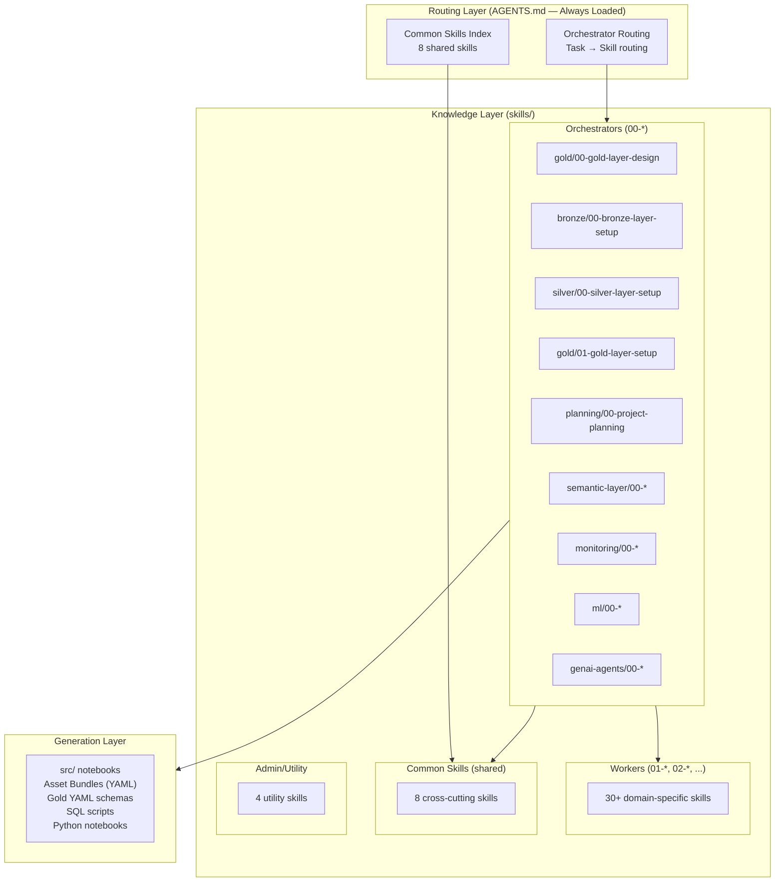
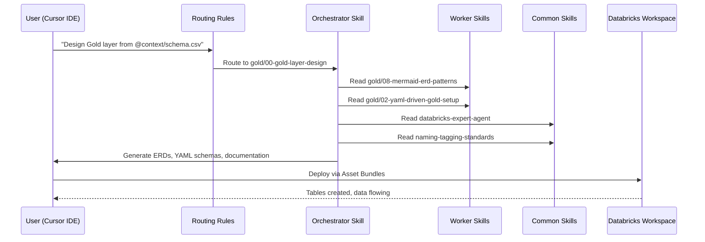

# 02 — Architecture Overview

## System Architecture

The Data Product Accelerator uses a **skills-first architecture** where domain expertise lives in Agent Skills using the open [SKILL.md format](https://agentskills.io). This is a deliberate evolution: the original framework embedded all patterns in 46+ IDE-specific rules, which created context-window pressure and IDE lock-in. The restructured framework uses a single `AGENTS.md` entry point that routes to 50 Agent Skills, each following a progressive disclosure pattern.

The architecture has three layers: a **routing layer** (`AGENTS.md` — universal entry point), a **knowledge layer** (50 Agent Skills), and a **generation layer** (the output code, configurations, and documentation that the AI assistant produces).

### Architecture Diagram



### Architecture Diagram (ASCII)

```
┌─────────────────────────────────────────────────────────────────────┐
│                   ROUTING LAYER (AGENTS.md — Universal Entry Point)  │
│                                                                     │
│  Orchestrator Routing         Common Skills Index                   │
│  "What task?" → route to      "Which shared skills to read?"        │
│  correct orchestrator                                               │
└────────────────────────────────┬────────────────────────────────────┘
                                 │ routes to
┌────────────────────────────────▼────────────────────────────────────┐
│                  KNOWLEDGE LAYER (50 Agent Skills)                  │
│                                                                     │
│  ┌───────────────────────────────────────────────────────────────┐  │
│  │  ORCHESTRATORS (00-*)        WORKERS (01-*, 02-*, ...)       │  │
│  │  ┌─────────────────────┐     ┌─────────────────────────────┐ │  │
│  │  │ SKILL.md (~2K tok)  │────▶│ SKILL.md (~2K tok)          │ │  │
│  │  │ "Read worker X now" │     │ references/ (2-8K each)     │ │  │
│  │  └─────────────────────┘     │ scripts/ (execute on demand)│ │  │
│  │                              │ assets/templates/ (copy)    │ │  │
│  │                              └─────────────────────────────┘ │  │
│  └───────────────────────────────────────────────────────────────┘  │
│                                                                     │
│  ┌───────────────────────────────────────────────────────────────┐  │
│  │  COMMON SKILLS (8 shared)        ADMIN SKILLS (4 utilities)  │  │
│  │  Expert Agent, Asset Bundles     Skill Creator, Freshness    │  │
│  │  Autonomous Ops, Naming          Self-Improvement, Docs      │  │
│  │  Python Imports, Table Props     Cursor Rules, Rule-to-Skill │  │
│  │  Schema Mgmt, UC Constraints                                 │  │
│  └───────────────────────────────────────────────────────────────┘  │
└────────────────────────────────┬────────────────────────────────────┘
                                 │ generates
┌────────────────────────────────▼────────────────────────────────────┐
│                      GENERATION LAYER (Output)                      │
│                                                                     │
│  src/ Python notebooks          databricks.yml Asset Bundles        │
│  gold_layer_design/yaml/        SQL DDL and MERGE scripts           │
│  plans/ and manifests           Dashboard JSON, Alert configs       │
│  Metric View YAML               Genie Space configurations          │
└─────────────────────────────────────────────────────────────────────┘
```

## Data Flow

### End-to-End Pipeline Sequence



### Data Flow Table

| Step | From | To | Data | Description |
|------|------|-----|------|-------------|
| 1 | `context/*.csv` | Gold Design orchestrator | Schema CSV | Customer source schema parsed into table inventory |
| 2 | Gold Design | `gold_layer_design/yaml/` | YAML schemas | Dimensional model with ERDs, columns, constraints |
| 3 | Schema CSV | Bronze orchestrator | DDL templates | Bronze tables created matching source schema |
| 4 | Bronze tables | Silver orchestrator | DLT pipelines | Streaming ingestion with DQ expectations |
| 5 | Silver tables | Gold Impl orchestrator | MERGE scripts | SCD Type 1/2 dimensions, fact aggregations |
| 6 | Gold YAML | Planning orchestrator | YAML manifests | Contracts for semantic, monitoring, ML, GenAI |
| 7 | Manifests | Semantic orchestrator | Metric Views, TVFs | Semantic layer for Genie natural language |
| 8 | Manifests | Monitoring orchestrator | Monitors, dashboards | Observability on Gold tables |
| 9 | Manifests | ML orchestrator | Training pipelines | MLflow experiments and batch inference |
| 10 | Manifests | GenAI orchestrator | Agent code | ResponsesAgent with Genie Space integration |

## Component Inventory

### By Category

| Category | Count | Components |
|----------|-------|------------|
| Orchestrator Skills | 9 | Gold Design, Bronze, Silver, Gold Impl, Planning, Semantic, Observability, ML, GenAI |
| Worker Skills | 27 | Faker, DLT expectations, DQX, YAML setup, Merge patterns, Dedup, Schema validation, Grain validation, ERD patterns, Gold documentation, Metric Views, TVFs, Genie Spaces, Genie API, Genie Optimization, Lakehouse Monitoring, Dashboards, Alerts, Anomaly Detection, Responses Agent, Evaluation, Memory, Prompts, Multi-agent, Deployment, Production Monitoring, MLflow GenAI Foundation |
| Common Skills | 8 | Expert Agent, Asset Bundles, Autonomous Ops, Naming Standards, Python Imports, Table Properties, Schema Management, UC Constraints |
| Admin/Utility Skills | 4 | Skill Creator, Documentation Org, Self-Improvement, Skill Freshness Audit |
| Standalone Skills | 2 | Exploration Notebooks, Skill Navigator |
| Entry Point | 1 | AGENTS.md (universal routing + common skills index) |

### Repository Structure

```
project_root/
├── AGENTS.md                           # Universal entry point (routing + common skills index)
├── QUICKSTART.md                       # One-prompt-per-stage guide
├── README.md                           # Project overview
├── skills/                             # 50 Agent Skills (open SKILL.md format)
│   ├── admin/                          # 4 utility skills
│   ├── bronze/                         # 2 skills (00-orchestrator, 01-worker)
│   ├── common/                         # 8 shared skills
│   ├── exploration/                    # 1 skill
│   ├── genai-agents/                   # 9 skills
│   ├── gold/                           # 9 skills (2 orchestrators, 7 workers)
│   ├── ml/                             # 1 orchestrator skill
│   ├── monitoring/                     # 5 skills
│   ├── planning/                       # 1 skill
│   ├── semantic-layer/                 # 6 skills
│   ├── silver/                         # 3 skills
│   └── skill-navigator/               # Navigator skill (full version)
├── context/
│   └── Wanderbricks_Schema.csv         # Customer schema input
└── docs/                               # Human-readable documentation
```

## Technology Stack

| Layer | Technology | Purpose |
|-------|------------|---------|
| IDE | Cursor IDE with Agent mode | AI-assisted code generation |
| AI Model | Claude (via Cursor) | Reads skills and generates code |
| Governance | Unity Catalog | Catalogs, schemas, tables, lineage, tags |
| Storage | Delta Lake | ACID transactions, time travel, CDF |
| Streaming | Delta Live Tables (DLT) | Bronze → Silver streaming pipelines |
| Deployment | Databricks Asset Bundles | Infrastructure as Code (jobs, pipelines, dashboards) |
| Semantic | Metric Views + TVFs | Genie natural language query interface |
| Observability | Lakehouse Monitoring | Data profiling, custom metrics, drift detection |
| Visualization | AI/BI (Lakeview) Dashboards | Charts, KPIs, filtered views |
| Alerting | SQL Alerts V2 | Threshold, percentage change, anomaly alerts |
| ML | MLflow + Feature Store | Experiment tracking, model registry, batch inference |
| GenAI | MLflow ResponsesAgent | Streaming agents with Genie Space integration |
| Memory | Lakebase | Agent short-term and long-term memory |

## Design Principles

### Principle 1: Skills-First Architecture

Domain expertise lives in Agent Skills — not cursor rules. Rules are lightweight routers (2 files, <1K tokens total). Skills are rich knowledge packages with progressive disclosure (SKILL.md → references/ → scripts/ → assets/). This keeps every interaction under the 200K token budget while allowing unlimited skill growth.

### Principle 2: Design-First Pipeline

The Gold dimensional model is designed *before* building Bronze or Silver. This prevents the common anti-pattern of building ingestion layers without knowing the target schema. The pipeline starts with `context/*.csv` → Gold Design, then builds backward through Bronze → Silver → Gold Implementation.

### Principle 3: Extract, Don't Generate

Never hardcode table names, column names, or function signatures. Always extract them from the Gold YAML schemas (the single source of truth). This prevents hallucinations, typos, and schema mismatches that plague AI-generated code.

### Principle 4: Orchestrator-First Routing

For end-to-end workflows, always route to the orchestrator (00-*) first. The orchestrator knows which worker skills and common skills to load for each phase. Workers can be used standalone for specific tasks.

### Principle 5: Plan-as-Contract

The Planning stage (stage 5) emits YAML manifest files that downstream stages consume as implementation contracts. This decouples planning from execution while ensuring consistency.

## Security Considerations

- All tables use Unity Catalog governance with lineage tracking
- PII columns are tagged with `data_classification` tags
- Access is controlled through UC grants (not workspace ACLs)
- Asset Bundles use target-based deployment (dev/staging/prod)
- GenAI agents use On-Behalf-Of (OBO) authentication via Automatic Auth Passthrough

## Scalability

The skills-first architecture scales in three dimensions:
1. **Skill count** — New skills can be added without affecting existing ones (no rule conflicts)
2. **Domain count** — New domains (e.g., IoT, streaming) add new skill directories
3. **Complexity** — Progressive disclosure keeps simple tasks fast while deep tasks load references on demand

## Next Steps

- Deep dive into the [03-Design-First Pipeline](03-design-first-pipeline.md) workflow
- Review [04-Agent Skills System](04-agent-skills-system.md) for skill architecture details
- Explore [05-Skill Domains](05-skill-domains.md) for the complete skill inventory
